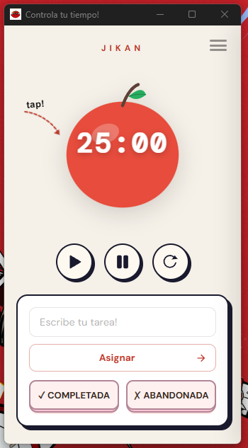
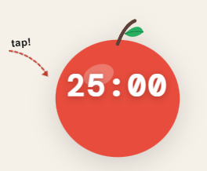
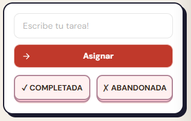
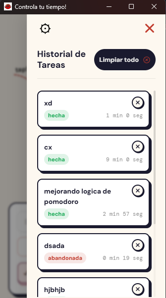
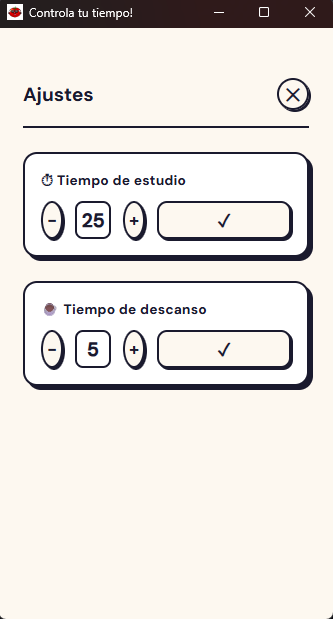
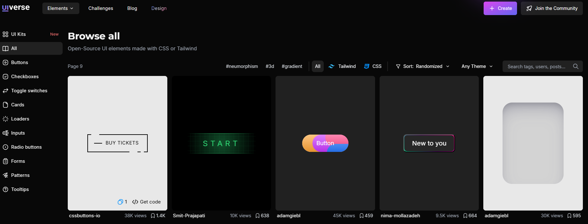

<div align="center">

# Jikan

Pomodoro timer de escritorio con gestión de tareas, historial persistente y una UI cream & sketch.



[](https://www.electronjs.org/)
[](https://developer.mozilla.org/es/docs/Web/JavaScript)
[](https://developer.mozilla.org/es/docs/Web/HTML)
[](https://developer.mozilla.org/es/docs/Web/CSS)

</div>

---

## ¿Qué es Jikan?

**Jikan** (時間, *"tiempo"* en japonés) es una app de escritorio construida con Electron que implementa la técnica Pomodoro. Sin distracciones, sin cuentas, sin internet. Todo corre local.

La lógica del timer, la gestión de tareas y el historial fueron desarrollados a mano. Para acelerar el proceso de diseño y resolución de bugs se usaron herramientas de IA como Claude y Gemini. El proyecto nació como parte de mi formación en Ingeniería de Software con IA en SENATI.

---

## Capturas

<div align="center">

| Timer principal | Gestión de tareas |
|:-:|:-:|
|  |  |

| Historial | Panel de ajustes |
|:-:|:-:|
|  |  |

</div>

---

## Features

- Ciclos Pomodoro automáticos — al terminar el estudio arranca el descanso solo, y viceversa.
- Asigna una tarea a cada bloque y márcala como completada o abandonada al terminar.
- Las tareas se guardan en `datos.json` y sobreviven al cierre de la app.
- Tiempos configurables — ajusta minutos de estudio (1–60) y descanso (1–30) desde ajustes o directamente haciendo clic en el reloj.
- Dos tipos de notificación: una principal para eventos del ciclo y una no invasiva para confirmaciones.
- Audio diferenciado para inicio de descanso y vuelta al estudio.

---

## UI

Los componentes visuales como botones y inputs fueron tomados y adaptados desde **[uiverse.io](https://uiverse.io/elements?page=3)**, una librería open source de elementos UI en CSS puro.

<div align="center">



</div>

---

## Stack

| Tecnología | Uso |
|---|---|
| Electron.js | Shell de escritorio, acceso a filesystem |
| HTML + CSS | Estructura y estilos |
| JavaScript (Vanilla) | Lógica del timer, tareas e historial |
| Node.js `fs` | Persistencia local en `datos.json` |
| Nodemon | Para un desarrollo mas comodo |

---

## Instalación

```bash
git clone https://github.com/TU_USUARIO/jikan.git
cd jikan
npm install
npm start
```

---

## Estructura

```
jikan/
├── main.js
├── renderer.js
├── index.html
├── estilos.css
├── datos.json           # autogenerado
├── descanso.mp3
├── fueraDescanso.mp3
└── tomato.ico
```

---

## Developer

[Ghian Marco Escalante Cárdenas](https://github.com/TU_USUARIO)

---

<div align="center">
Hecho para controlar mis horarios ٩(◕‿◕｡)۶
</div>